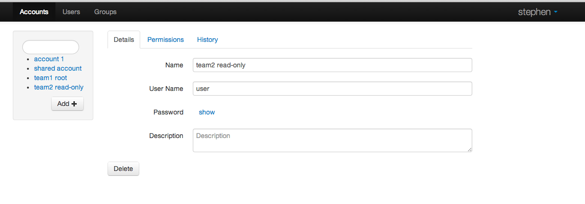
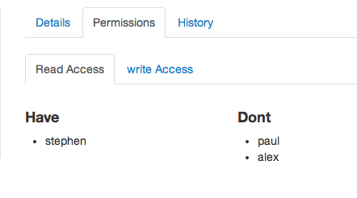

Acorn Accounts
==============
A web based password safe for teams.

DONE
----
* crud password
* password title description
* users
* encrypt passwords
* some simple login
* Auto create user when new valid x-remote-user is found.
* Name it. Acorn Accounts the password safe.
* logout
* Marketing page should list some of the features
* Not a generic constraint exception.
* build template cache.

TODO
----
* List display should be a table. title, desc, mod time. Click to enter details.
* Models need created & modified times.
* Do I need to escape the input.
* password permissions
* Test coverage.
* minify the contrib stuff.
* more marketing. Describe Features. Twitter link.
* Ask a graphic artist to make a squirrel picture.
* audit log
* encrypt more fields. username description etc.
* creating a new user with the same username as another user should present a nice error. 
* export all passwords
* update password should create a new one and flag the old one old. Should be able to display the old ones.
* Licensing. How would I manage licenses. Spreedsheet. Should I have license codes. That code could simply be a property that needs to match something hard coded.
* Document install process
* How do you become a registered business. Do I want that.
* Email Notifications

